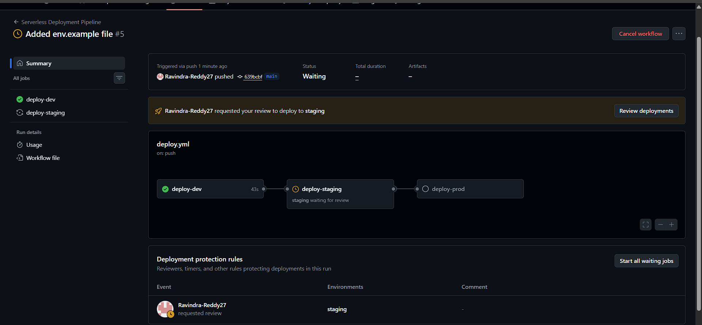
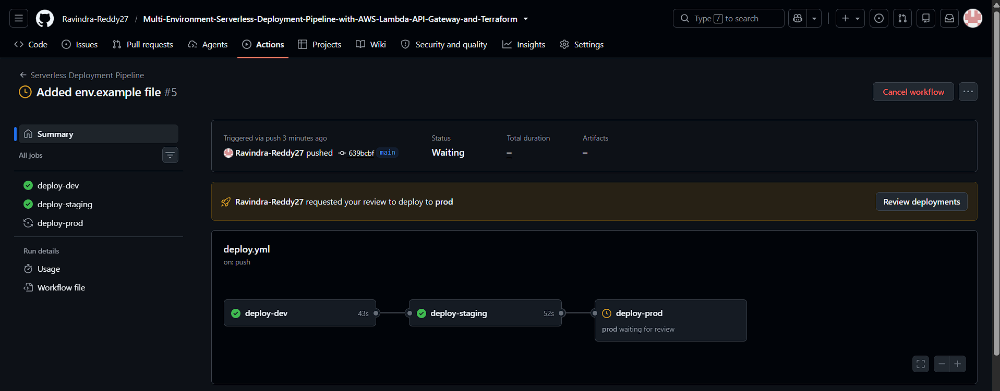
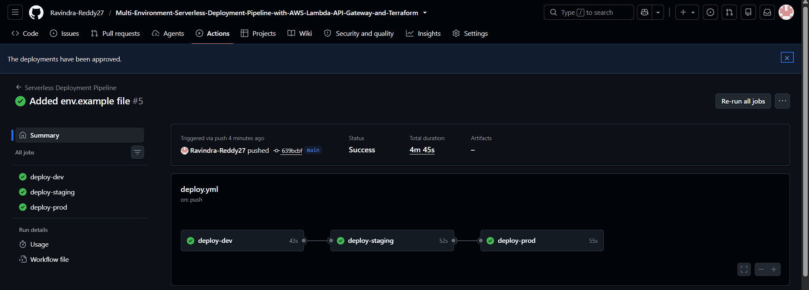
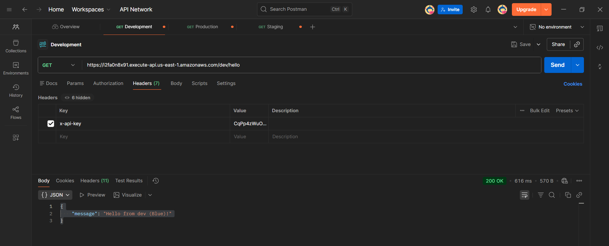
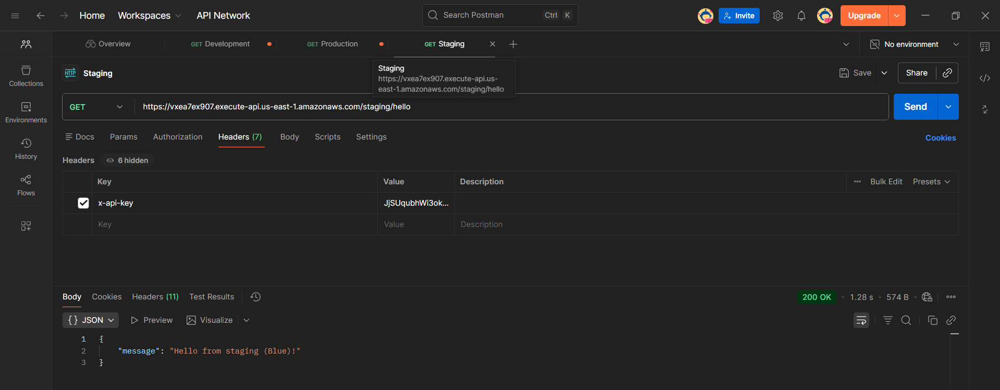
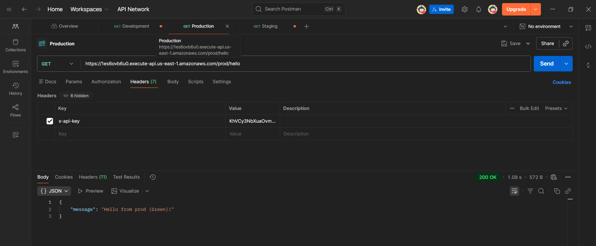
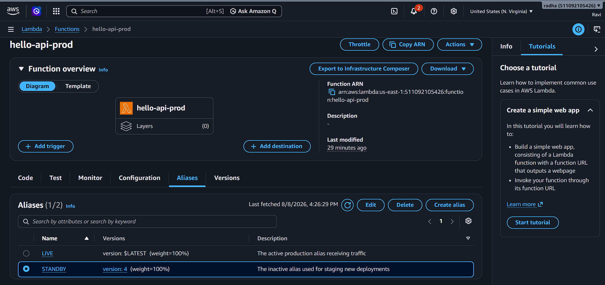

# Multi-Environment-Serverless-Deployment-Pipeline-with-AWS-Lambda-API-Gateway-and-Terraform

## Project Overview
This project demonstrates a robust, automated CI/CD pipeline for a serverless API built with AWS Lambda and API Gateway. The infrastructure is entirely provisioned using Infrastructure as Code (Terraform) across three distinct environments: `dev`, `staging`, and `prod`. 

A core feature of this architecture is the implementation of a zero-downtime **Blue/Green deployment strategy** for the production environment, ensuring seamless updates and immediate rollback capabilities without impacting live users.

## Architecture & Design Decisions
* **Infrastructure as Code (IaC):** Utilizes Terraform with a modular structure (separating common Lambda/API Gateway modules from environment-specific roots) for high reusability and maintainability.
* **State Management:** Terraform state is securely managed using an AWS S3 backend with DynamoDB locking to prevent concurrent modification and data loss.
* **Security & IAM:** Adheres strictly to the principle of least privilege. Lambda execution roles only contain the necessary permissions, and endpoints are secured via API Gateway API Keys and Usage Plans.
* **Observability:** Lambda functions are configured to stream logs directly to AWS CloudWatch, and a CloudWatch Metric Alarm is configured to trigger if the error count exceeds 0 within a 5-minute window.
* **Blue/Green Deployments:** The production environment leverages AWS Lambda aliases (`LIVE` and `STANDBY`). The GitHub Actions pipeline dynamically shifts traffic between versions after publishing, decoupling the infrastructure state from the application version.

## Setup & Local Deployment

### Prerequisites
* AWS Account with programmatic access configured (`AWS_ACCESS_KEY_ID`, `AWS_SECRET_ACCESS_KEY`)
* Terraform (v1.5+)
* Python 3.9+
* Make (for local orchestration)

### Local Configuration
1. Clone the repository:
   ```bash
   git clone https://github.com/Ravindra-Reddy27/Multi-Environment-Serverless-Deployment-Pipeline-with-AWS-Lambda-API-Gateway-and-Terraform.git
   cd Multi-Environment-Serverless-Deployment-Pipeline-with-AWS-Lambda-API-Gateway-and-Terraform
   ```

### Environment Variables

Review `.env.example` to understand the required environment variables for:

- Local testing
- GitHub Actions CI/CD secrets


### Initial Infrastructure Setup (Terraform Backend)

Before deploying this project locally or via GitHub Actions, you must manually create an AWS S3 bucket and a DynamoDB table to handle Terraform's remote state storage and state locking. This ensures state consistency and prevents concurrent deployment conflicts.

**1. Create the S3 Bucket (State Storage)**

Create a uniquely named S3 bucket to store the `terraform.tfstate` files. 
* *Note: S3 bucket names must be globally unique.*
```bash
aws s3api create-bucket `
    --bucket your-unique-tf-state-bucket-name `
    --region us-east-1
```
Enable versioning on the bucket.

```bash
aws s3api put-bucket-versioning `
    --bucket your-unique-tf-state-bucket-name `
    --versioning-configuration Status=Enabled
```

 Update the bucket value inside terraform/environments/*/main.tf to match your new bucket name.

**2. Create the DynamoDB Table (State Locking)**

Create a DynamoDB table to enable **Terraform state locking** during deployments. This prevents multiple users or CI/CD pipelines from modifying the same Terraform state simultaneously.

```bash
aws dynamodb create-table `
    --table-name terraform-state-locks `
    --attribute-definitions AttributeName=LockID,AttributeType=S `
    --key-schema AttributeName=LockID,KeyType=HASH `
    --billing-mode PAY_PER_REQUEST `
    --region us-east-1
```


---

## Using the Makefile

A `Makefile` is provided to simplify common Terraform operations for local development.

### Deploy to Development

```bash
make dev
```

### Deploy to Staging

```bash
make staging
```

### Deploy to Production

```bash
make prod
```

### Destroy All Environments

```bash
make clean
```

---

## CI/CD Pipeline

The entire deployment lifecycle is automated using GitHub Actions located at:

```text
.github/workflows/deploy.yml
```

### GitHub Repository Configuration

To successfully run the GitHub Actions pipeline, you must configure specific Environments, Secrets, and Variables within your GitHub repository settings.

#### 1. GitHub Environments
Navigate to **Settings > Environments** in your repository and create the following three environments to manage deployment targets and manual approval gates:

*   **`dev`**: No protection rules required.
*   **`staging`**: 
    *   Check **Required reviewers**.
    *   Add yourself (or your team members) as reviewers to enforce a manual approval gate before deploying to staging.
*   **`prod`**:
    *   Check **Required reviewers**.
    *   Add yourself as a reviewer to enforce the final manual approval gate before executing the Blue/Green production shift.

#### 2. Repository Secrets
Navigate to **Settings > Secrets and variables > Actions** and add the following under **Repository secrets**:

*   `AWS_ACCESS_KEY_ID`: Your programmatic AWS access key.
*   `AWS_SECRET_ACCESS_KEY`: Your programmatic AWS secret key.
*   `TF_STATE_BUCKET`: The exact name of your AWS S3 bucket used for Terraform state storage (e.g., `ravi-tf-state-123456`).

#### 3. Repository Variables (Optional)
While the AWS Region is defined in the `deploy.yml` file, you can optionally extract it to repository variables for easier management:
*   `AWS_REGION`: The target AWS region (e.g., `us-east-1`).

## Pipeline Triggers

The workflow automatically runs on:

- Push to the `main` branch
- Push to any `feature/*` branch

### Feature Branch

For `feature/*` branches, the pipeline will:

- Run `terraform plan`
- Run `terraform apply` **only for the Development environment**

### Main Branch

For the `main` branch, the pipeline performs the complete promotion flow:

```text
Development
      │
      ▼
Terraform Plan
      │
      ▼
Terraform Apply (Dev)
      │
      ▼
Manual Approval
      │
      ▼
Terraform Apply (Staging)
      │
      ▼
Manual Approval
      │
      ▼
Terraform Apply (Production)
```

---

# Manual Approval Gates

To simulate a real-world enterprise release process, deployments to **Staging** and **Production** require manual approval.

An authorized user must:

1. Open the **GitHub Actions** tab.
2. Select the running workflow.
3. Approve the deployment through **GitHub Environments**.
4. The pipeline then continues automatically.

---

## Blue/Green Deployment

During a production deployment:

1. Terraform provisions the new infrastructure.
2. A new Lambda version (**Green**) is published.
3. Production traffic continues to use the previous version (**Blue**).
4. After validation, the AWS CLI updates the **LIVE** Lambda alias.
5. Traffic is safely shifted to the new version.

### Before Deployment (Blue)

```json
{
  "message": "Hello from prod (Blue)!"
}
```

### After Deployment (Green)

```json
{
  "message": "Hello from prod (Green)!"
}
```

---

# 📸 Visual Evidence

## 1. CI/CD Pipeline Execution

Demonstrates:

- Successful workflow execution
- Manual approval gates
- Environment promotion





---

## 2. API Gateway Stages

Shows:

- Development endpoint
- Staging endpoint
- Production endpoint

**Development:**


**Staging:**


**Production:**


---

## 3. Lambda Versions & Aliases (Blue/Green)

Demonstrates:

- Lambda versions
- `LIVE` alias
- `STANDBY` alias
- Blue/Green deployment strategy

